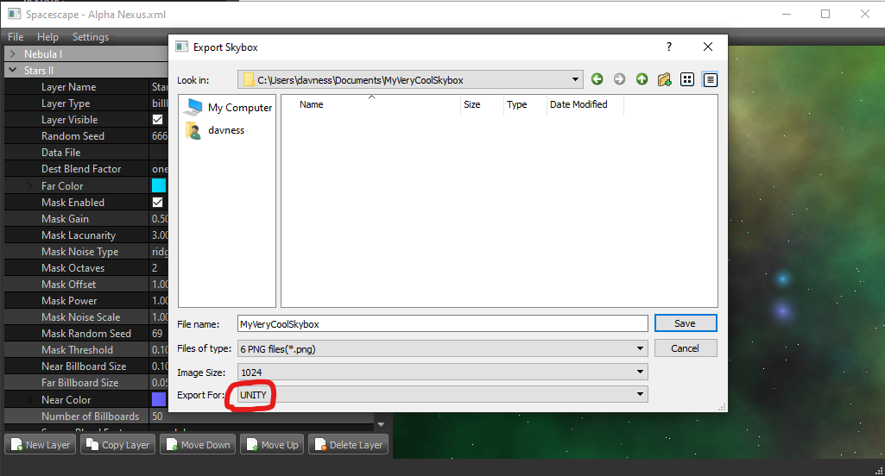
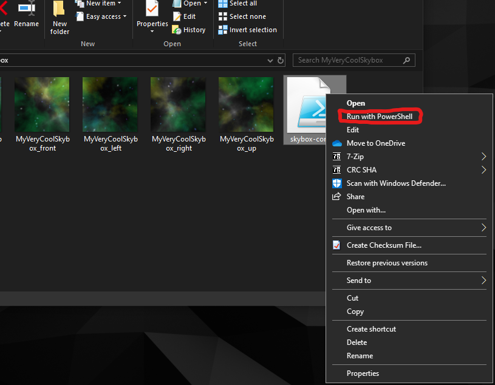

<h1><p align="center">Spacescape: Unity to Roblox Converter</p></h1>
<h2><p align="center">Version 1.0.0</p></h2>

- If you ever made a skybox with [spacescape](http://alexcpeterson.com/spacescape/) for your Roblox project, you probably have figured out that none of the export options available are really suitable to be imported to Roblox - something will be always off and you need to remember that this part needs to be rotated left, that part needs to be rotated right, you need to swap these two images, etc.

- `spacescape-roblox-converter` is a script that allows you to **just forget this.** Just run the script and your exported skybox is ready to go!

- Written in Powershell, it is basically compatible with any supported Windows version (7 and beyond), out of the box. No need to install runtimes or whatever. You've got all tools already.

⚠️ **NOTE:** This only works on **Windows** PowerShell. No PowerShell Core.

## Prepare to use the script

Running Powershell scripts requires the Execution Policy to be configured.

Open a powershell windows and type in the following (you *don't* need to launch it as administrator):

```ps1
Set-ExecutionPolicy RemoteSigned -Scope CurrentUser
```

<details>
  <summary>Why is this needed?</summary>
  
  - The Execution Policy is a feature that is shipped with Windows PowerShell, which determines which kind of scripts can run on your computer.

  - By default, this policy is set to `Restricted` - meaning that no scripts are allowed to run.

  - What we're doing is adjusting this setting to `RemoteSigned` - meaning that all scripts that exist locally in the computer can run, but those you download from the internet (like this one) need to be *signed* and come with a certificate.

</details>

You're all set!

## Usage instructions:

- Make your skybox just like as you would. Export it as a **UNITY** skybox. *(If you do not, don't fret! The script will remind you to do so.)*



- There are actually two ways to use the script. Use the only that fits you best.

<details>
<summary>The Clicky Way</summary>

- Copy the script to the same directory of your exported skybox; Right Click the script and select "Run with PowerShell"



- Type in the name of the skybox and **Voilà!**


</details>

<details>
<summary>Via the command line</summary>

- Open a Powershell window and navigate to your directory;

- Invoke the script and pass in the skybox name!


```ps1
.\skybox-convert.ps1 -name <skybox-export-name>
```
</details>